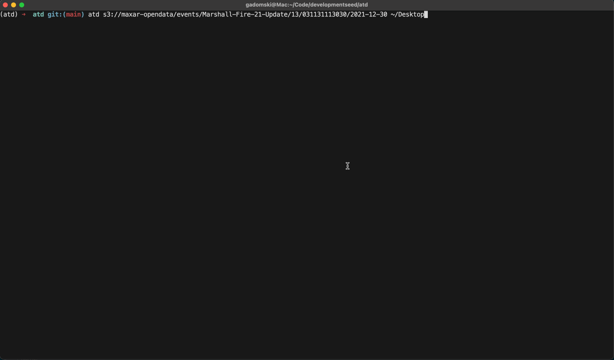

# atd

the Ability To Duplicate

> [!WARNING]
> This is a proof-of-concept that is not intended for production use.

See [the docs](https://developmentseed.org/atd/) for a step-by-step walkthrough of what's going on.



## Motivation

Inspired by a discussion around data duplication during the "Meet the Partners" segment of Team Week 2025, this repository allows you to, with one command:

1. Copy all the geospatial assets from one blob storage to another using [obstore](https://developmentseed.org/obstore/)
2. Create a STAC item for each of those assets that includes a link back to original asset and a checksum so folks can verify that they're the same asset
3. Create a single [stac-geoparquet](https://github.com/stac-utils/stac-geoparquet) to hold all of those items

## Usage

Install:

```shell
python -m pip install git+ssh://git@github.com/developmentseed/atd.git
```

Then:

```shell
# You could write to s3 (or some other blob storage) as well
$ atd s3://maxar-opendata/events/Marshall-Fire-21-Update/13/031131113030/2021-12-30 ~/Desktop
62.6 MB written to file:///Users/gadomski/Desktop
Items available at file:///Users/gadomski/Desktop/items.geoparquet 
```

There's two assets:

```shell
$ stacrs translate ~/Desktop/items.geoparquet | jq '.features.[0] | .assets'
{
  "original": {
    "href": "s3://maxar-opendata/events/Marshall-Fire-21-Update/13/031131113030/2021-12-30/10200100BCB1A500-pan.tif",
    "file:checksum": "12202f1ea332dd0e7a559b78e16952c5b9be81e44ddf9768634db12dcb311b3f587f"
  },
  "data": {
    "href": "file:///Users/gadomski/Desktop/10200100BCB1A500-pan.tif",
    "type": "image/tiff; application=geotiff",
    "roles": [
      "data"
    ],
    "eo:bands": [
      {
        "name": "b1",
        "description": "gray"
      }
    ],
    "file:checksum": "12202f1ea332dd0e7a559b78e16952c5b9be81e44ddf9768634db12dcb311b3f587f"
  }
}
```

You can use `stacrs serve` to browse them:

```shell
$ stacrs serve ~/Desktop/items.geoparquet                                  
Serving a STAC API at http://127.0.0.1:7822
```

Then go to <https://radiantearth.github.io/stac-browser/#/external/http:/127.0.0.1:7822> to browse.

## Limitations

- There's no guards on the number of simultaneous downloads, so you could swamp yourself pretty easily
- No configuration (yet)
